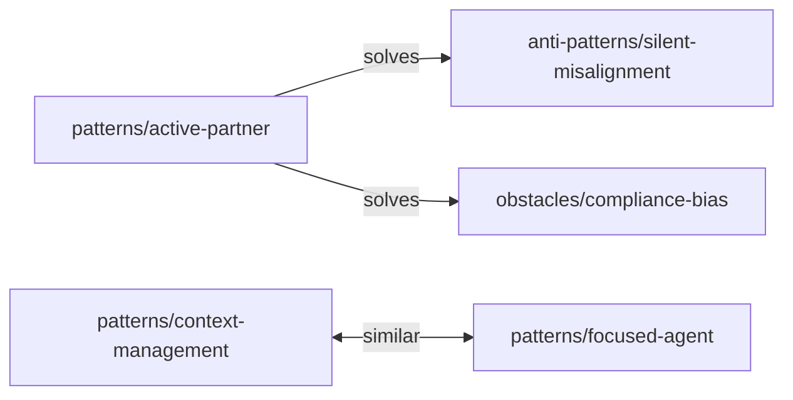

# Relationships

Patterns, anti-patterns, and obstacles are connected through a centralized relationship graph stored in `/documents/relationships.mmd`.

## Format

The file uses Mermaid graph syntax:

- `-->|type|` — directional relationship (source → target)
- `<-->|type|` — bidirectional relationship

## Relationship Types

- `solves` — a pattern addresses an anti-pattern or obstacle
- `similar` — two patterns with related approaches
- `enables` — one pattern makes another possible
- `uses` — one pattern depends on another
- `causes` — an anti-pattern or obstacle leads to a problem
- `alternative` — a different approach to the same problem
- `related` — general connection

## How They Display

On each document's detail page, a sidebar shows related items grouped by category. The direction matters for labeling — "Solves" vs "Solved by" depending on whether the current document is the source or target.

The home page includes a force-directed graph visualization showing the entire relationship network, color-coded by category and relationship type.

## Validation

A build-time validation step (`npm run validate`) checks that every slug referenced in the graph points to an existing document. Broken references fail the build.

## Coverage

Not all relationships between patterns are documented yet. The graph is growing as the collection matures. Core connections exist, but many valid relationships between existing documents remain to be added.
